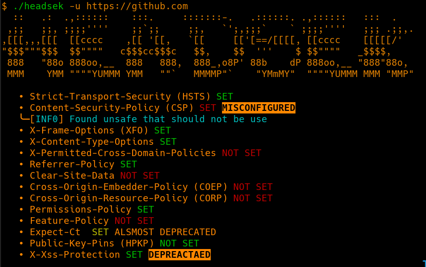

# HEADSEK: security header analyzer




This tools analyse security headers based on OWASP Secure Headers Project,
 for more informations about security header go visit: https://owasp.org/www-project-secure-headers/

### Usage:

```
-h, --help                   Show this help
-d, --description            Print description under the result
-n, --nologo                 don't print banner
-u, --url=URL                set target URL (not mandatory if url is last
                             parameter)
-k, --insecure               Ignore certificat issues
-U, --user-agent=USER-AGENT  set user-agent
-p, --post=POST-DATA         set post data (will use POST instead of GET)
-c, --cookies=COOKIES        set cookies
-v, --version                show version
```

`-u` is not mandatory if the URL is the last argument.

### Install:

```sh
git clone git@github.com:mmpx12/headsek.git
cd headsek
make
sudo make install
# or 
sudo make all
```
